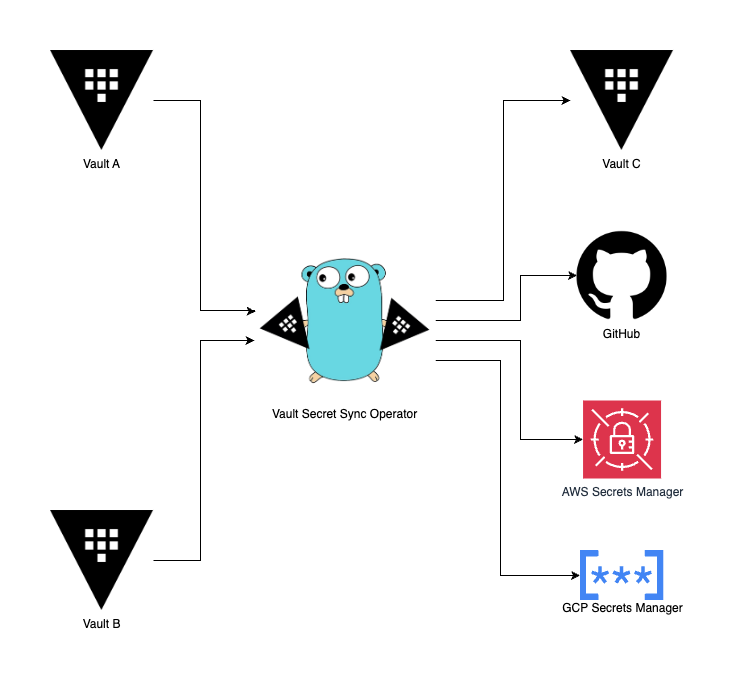
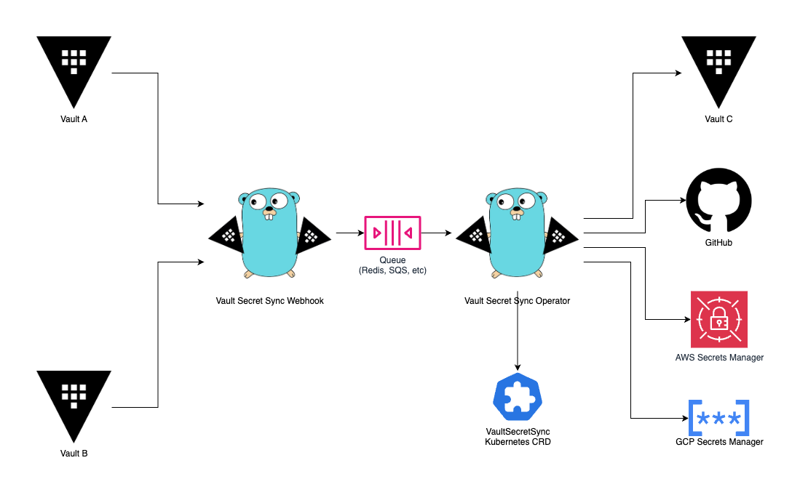

# Architecture

## High Level Architecture

Before we discuss how to technically deploy the solution, it is important to understand the high-level architecture of the service. The above reference architecture can be viewed as a "logical" architecture, as the service can be deployed in a variety of ways. Conceptually, the operator exposes a REST webhook endpoint at `/events` that listens for HashiCorp Vault audit log events. When an event is received, the operator will evaluate it against the configured `VaultSecretSync` resources and sync the secret to the respective destination secret store(s).

In the most basic deployment model, the operator can be deployed as a single process / docker container / pod. In this mode, the container both exposes the webhook server as well as performs the actual sync operation. This may not be ideal for a more security-conscious environment, as the exposed webhook service would need to be granted access to the backend secret stores and therefore could be a potential attack vector. For this reason, it is generally recommended to deploy the solution as a set of decoupled microservices, where the webhook service is deployed in a separate container / pod from the sync operator. This then allows you to enforce more strict network policies and security controls around the webhook service which then queues the work to be consumed by the operator service deeper in the network.

## Deployment Models

While this documentation generally focuses on Kubernetes-based deployments, do know that the service is not coupled to Kubernetes and therefore the same models discussed below can be followed to deploy the service in other environments, either as a set of docker containers, standalone processes, or a single binary.

### Single Binary

The simplest deployment model is to deploy the service as a single binary, as shown in the High Level Diagram above. This is the easiest way to get started with the service, but is not recommended for production deployments. In this model, the service will run as a single process that both listens for webhook events and performs the sync operation. The upside of this model is the ease of deployment, however the downside is that you must grant the exposed webhook service access to the backend secret stores, which may not be ideal from a security perspective.

### Microservices

The recommended deployment model is to decouple the microservices and rely on a queue to provide inter-service communication. In this model, the webhook service is deployed as a separate process / container / pod from the sync operator. The webhook service listens for audit log events, filters out irrelevant events, and then queues the relevant events to be consumed by the sync operator. The sync operator then runs in a separate process / container / pod and consumes the queued events, syncing the secrets to the destination secret store(s). In this model, the webhook service only needs to be granted limited access to the queue, and the sync operator only needs to be granted access to the destination secret store(s). Besides the optional Kubernetes metrics endpoint, the sync operator does not expose any other services, and all communication is done through the queue.

